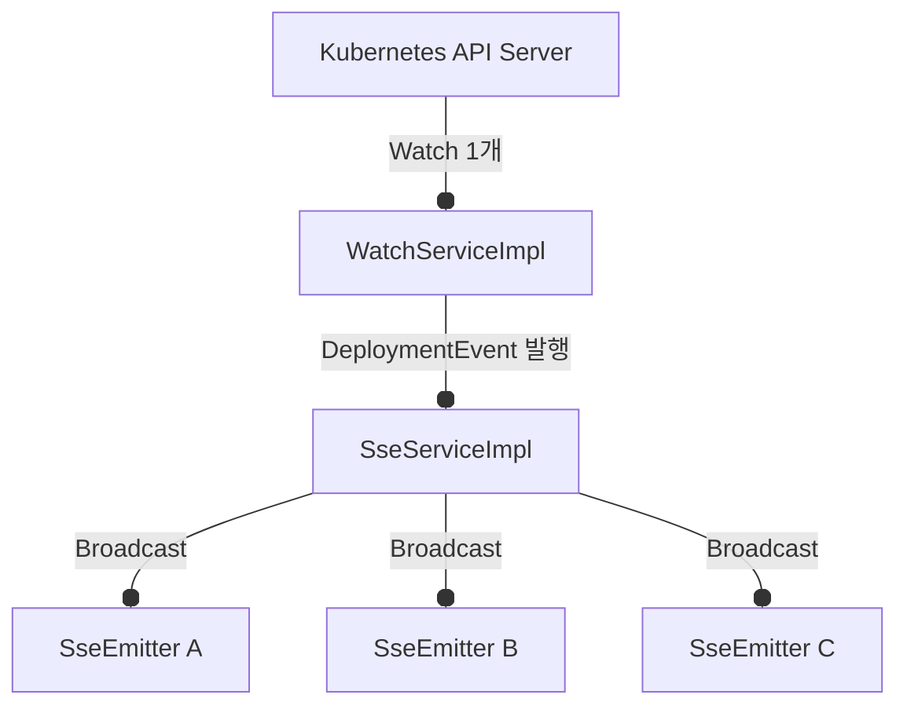

# Kubernetes Watch API와 SSE: 실시간 데이터 동기화 문제와 해결 방법

본 문서에서는 Kubernetes 클러스터의 Deployment 리소스 상태를 웹 대시보드 화면에 5초 이내의 준실시간으로 동기화하기 위해 **`Kubernetes Watch API`**와 **`Server-Sent Events (SSE)`**를 결합하여 설계하는 과정에서 겪은 문제들과, 이를 해결하기 위한 단계적 아키텍처 리팩토링 과정을 상세히 공유합니다.

---

## 1. 초기 설계: 단순 연결 구조와 병목 현상

초기 설계는 매우 단순했습니다. 프론트엔드에서 SSE 구독 요청을 보내면, 컨트롤러가 백그라운드 스레드에서 `Watch` 객체를 루프 돌며 데이터 변경이 발생할 때마다 Emitter로 이벤트를 쏴주는 구조였습니다.

```java
// ⚠️ 초안: 사용자별 Watch 생성 및 동기 전송
@GetMapping("/namespaces/{namespace}/deployments/stream")
public SseEmitter stream(@PathVariable String namespace) {
    SseEmitter emitter = new SseEmitter(0L);

    executor.submit(() -> {
        try (Watch<V1Deployment> watch = createDeploymentWatch(namespace)) {
            for (Watch.Response<V1Deployment> event : watch) {
                // 동기식으로 Emitter 전송
                emitter.send(SseEmitter.event().data(event));
            }
        } catch (Exception e) {
            emitter.completeWithError(e);
        }
    });
    return emitter;
}
```

### 🚨 초안 아키텍처의 치명적 한계
1. **K8s API 서버 부하 급증 (1:1 커넥션)**: 동일한 Namespace를 10명의 사용자가 동시에 모니터링한다면, K8s API 서버를 향해 총 10개의 독립적인 Watch HTTP/TCP 연결이 중복으로 개설됩니다. 이는 클러스터 규모가 커지고 모니터링 인원이 늘어날수록 API 서버의 CPU/메모리 고갈과 처리 한계 임계치를 유발합니다.
2. **동기식 전송 병목 및 스레드 블로킹**: `for (event : watch)` 루프 내부에서 `emitter.send()`를 동기적으로 바로 호출합니다. 만약 네트워크 레이턴시가 큰 클라이언트나 대기 시간이 길어진 브라우저가 존재할 경우, `send()` 메서드가 지연되고 결국 해당 Watch 스레드 전체가 블로킹 상태(Thread Blocked)에 빠지게 됩니다. 이로 인해 동일 스레드 상의 다른 로직이나 데이터 수집 흐름이 연쇄적으로 지연되는 병목이 발생합니다.

---

## 2. 2차 아키텍처: "Namespace당 1개의 Watch + N개 Emitter 공유"

1:1 연결 문제를 해결하기 위해 **"사용자 수와 무관하게 특정 Namespace를 모니터링하는 K8s Watch 커넥션은 오직 1개만 띄우고, 이를 다수의 사용자가 공유(Broadcast)하게 하자"**는 2차 아키텍처를 도입했습니다.



### 🚨 2차 아키텍처의 트러블슈팅 (동시성 예외 발생)
네임스페이스별 Emitter 목록을 `List<SseEmitter>`로 모으고, 이를 멀티스레드 경합에 대비하여 `Collections.synchronizedList`로 감싸 스레드 안전성을 확보하고자 했습니다.

```java
// ⚠️ 2차 시도의 Emitter 수집 형태
private final ConcurrentMap<String, List<SseEmitter>> namespaceEmitters = new ConcurrentHashMap<>();
```

그러나 아래와 같이 이벤트를 브로드캐스트하는 도중, 네트워크가 유실되거나 브라우저 탭을 닫은 사용자의 Emitter 연결 해제 작업이 백그라운드 스레드에서 돌면서 **`ConcurrentModificationException`**이 빈번하게 발생했습니다.

```java
// 🚨 이 루프를 도는 도중 다른 스레드가 emitters.remove()를 하면 예외 발생!
Iterator<SseEmitter> iterator = emitters.iterator();
while (iterator.hasNext()) {
    SseEmitter emitter = iterator.next();
    emitter.send(SseEmitter.event().data(data));
}
```

#### 💡 Collections.synchronizedList의 동작 원리적 한계
`Collections.synchronizedList`는 단일 `add()`, `remove()` 같은 단순 원자 메서드 호출 시에는 인스턴스 락(Lock)을 공유하여 동시 수정을 막지만, **반복자(`Iterator`)나 향상된 `for` 루프를 사용해 요소를 순회하는 상황에서는 동기화 락을 제공하지 않습니다.** 
따라서 순회 작업 도중 다른 스레드가 요소를 삽입하거나 삭제하게 되면, 자바 컬렉션 고유의 Fail-Fast 메커니즘이 동작하여 `ConcurrentModificationException` 예외가 즉각 유발됩니다. 이를 예방하려면 순회 코드 전체를 `synchronized(list) {}` 블록으로 묶어야 하나, 이는 해당 리스트를 건드리는 모든 스레드를 긴 대기 상태(Lock Contention)에 빠뜨려 심각한 성능 부하를 가중시킵니다.

---

## 3. 최종 아키텍처: 스레드 안전성과 자원 누수 완전 해결

위의 트러블슈팅 과정들을 겪으며, 최종적으로 아래와 같이 **비동기 스레드 풀 분리**, **CopyOnWriteArrayList 적용**, **putIfAbsent 중복 제어**, **자원 해제 책임 단일화**를 조합한 고품질 아키텍처를 구현했습니다.

### ✨ 핵심 개선 사항 및 설계 원리

#### 1) `CopyOnWriteArrayList` 도입을 통한 동시성 최적화
`namespaceEmitters`의 값으로 `CopyOnWriteArrayList`를 채택했습니다. 

| 비교 항목 | `Collections.synchronizedList` | `CopyOnWriteArrayList` |
| :--- | :--- | :--- |
| **기본 메커니즘** | 단순 동기화 래퍼(Mutex Lock) | 쓰기 동작 시 내부 배열 사본 생성 (Write-on-Copy) |
| **읽기/순회 성능** | 락 경합으로 인해 동시 읽기 차단 및 병목 | 락 프리(Lock-Free)로 모든 스레드가 고속 병렬 읽기 가능 |
| **순회 중 수정** | `ConcurrentModificationException` 유발 (외부 락 필요) | 예외 발생 없음 (순회 시점의 스냅샷 배열을 안전하게 참조) |
| **적합한 시나리오** | 쓰기 작업 비율이 매우 높은 환경 | **읽기/브로드캐스트 작업 비율이 압도적으로 높은 환경** |

`CopyOnWriteArrayList`는 쓰기(추가/삭제) 시점에 기존 배열의 사본을 복사하여 새로운 배열 참조로 갱신합니다. 이로 인해 브로드캐스트 루프를 도는 읽기 스레드는 기존 스냅샷 배열을 지속해서 바라보고 있으므로, 다른 스레드에서 Emitter를 제거하더라도 충돌이나 락 대기 없이 스레드 안전하게 동작합니다. 본 프로젝트는 이벤트를 클라이언트에 전달하는 **"읽기(브로드캐스트)"** 작업이 압도적으로 많기 때문에 성능과 안전성 측면에서 최고의 선택이 됩니다.

#### 2) 비동기 `sseExecutor` 스레드 풀 분리를 통한 블로킹 격리
Spring `ApplicationEventPublisher`를 통해 전파된 이벤트를 처리할 때, K8s Watch 수집 스레드가 클라이언트로의 전송 레이턴시에 말려들지 않도록 `sseExecutor` 비동기 풀에 작업을 위임(`sseExecutor.submit()`)했습니다. 이로써 K8s Watcher 스레드는 클라이언트의 네트워크 입출력 상태(SSE send)와 상관없이 무중단 감시 역할에만 집중할 수 있게 되어, 데이터 신뢰성과 전송 반응 속도를 비약적으로 높였습니다.

```
[K8s API Server]
      │
      ▼ (Chunked Stream)
[Watcher Thread]  ──► Publish Event (Spring Event)
                          │
                          ▼ (Decoupled & Non-blocking)
                    [sseExecutor Thread Pool] (비동기 병렬 전송)
                          ├──► Client A SseEmitter
                          └──► Client B SseEmitter
```

#### 3) `putIfAbsent`를 이용한 중복 Watch 생성 방어
다중 스레드에서 동시에 동일한 Namespace에 대한 Watch 획득 경합이 발생할 때, `putIfAbsent`를 통해 최초 1개만 안전하게 등록하고 늦게 도달한 중복 Watch는 생성 직후 즉시 `.close()` 처리하여 K8s API 서버 자원 낭비를 완전 차단했습니다.

#### 4) `@PreDestroy` 셧다운 훅 및 자원 해제 단일화
- 스프링 컨테이너 종료 시 스레드 풀이 강제로 끊기지 않고 리소스를 Graceful하게 반환하도록 `@PreDestroy`를 붙여 셧다운 처리를 명시했습니다.
- `removeEmitterFromNamespace(namespace, emitter)` 단 한 곳에 Emitter 삭제, Client Registry 정리, 더 이상 구독자가 없을 시 K8s Watch 해제(`stopNamespaceWatch`)까지 책임을 모조리 모아 자원 누수(Leak)를 원천 차단했습니다.

---

## 4. 최종 해결 코드

### 1) [WatchServiceImpl.java](file:///c:/Users/HamGeonwook/Desktop/Git/k8s-deployment-monitoring/backend/src/main/java/com/ham/backend/service/WatchServiceImpl.java) (K8s 감시 및 이벤트 발행)
```java
@Slf4j
@Service
@RequiredArgsConstructor
public class WatchServiceImpl implements WatchService {

    private final ApiClient apiClient;
    private final AppsV1Api api;
    private final ApplicationEventPublisher eventPublisher;
    private final ObjectMapper objectMapper;
    private final ExecutorService executorService = Executors.newCachedThreadPool();
    private final ConcurrentMap<String, Watch<V1Deployment>> namespaceWatchRegistry = new ConcurrentHashMap<>();

    public void startNamespaceWatch(String namespace) {
        log.info("🔄 Creating and starting Watch for namespace: {}", namespace);
        executorService.submit(() -> {
            Watch<V1Deployment> watch = null;
            try {
                watch = createDeploymentWatch(namespace);
                // putIfAbsent로 동시 경합 방지하며 단 1개의 Watch만 등록
                Watch<V1Deployment> previous = namespaceWatchRegistry.putIfAbsent(namespace, watch);
                if (previous != null) {
                    watch.close();
                    return;
                }

                for (Watch.Response<V1Deployment> event : watch) {
                    log.info("📥 Received event for namespace: {}, event: {}", namespace, event.type);
                    eventPublisher.publishEvent(new DeploymentEvent(this, namespace, formatDeploymentEventData(event)));
                }
            } catch (Exception e) {
                log.error("❌ Error while watching namespace {}: {}", namespace, e.getMessage());
            } finally {
                namespaceWatchRegistry.remove(namespace);
                if (watch != null) {
                    try {
                        watch.close();
                    } catch (IOException ignored) {}
                }
                log.info("✔️ Watch stopped for namespace: {}", namespace);
            }
        });
    }

    @PreDestroy
    public void shutdown() {
        log.info("⚙️ Shutting down executor service in WatchServiceImpl...");
        executorService.shutdown();
    }
    
    // ... createDeploymentWatch & formatDeploymentEventData
}
```

### 2) [SseServiceImpl.java](file:///c:/Users/HamGeonwook/Desktop/Git/k8s-deployment-monitoring/backend/src/main/java/com/ham/backend/service/SseServiceImpl.java) (비동기 브로드캐스트 및 수명 관리)
```java
@Slf4j
@Service
@RequiredArgsConstructor
public class SseServiceImpl implements SseService {

    private final WatchService watchService;
    private static final long SSE_TIMEOUT = 600_000L;
    private final Map<String, SseEmitter> sseEmitterRegistry = new ConcurrentHashMap<>();
    private final ConcurrentMap<String, CopyOnWriteArrayList<SseEmitter>> namespaceEmitters = new ConcurrentHashMap<>();
    private final ConcurrentMap<SseEmitter, String> emitterToClientIdMap = new ConcurrentHashMap<>();
    private final ExecutorService sseExecutor = Executors.newCachedThreadPool();

    @EventListener
    public void handleDeploymentEvent(DeploymentEvent event) {
        // Watch 스레드가 SSE 전송 대기에 묶이지 않도록 sseExecutor 비동기 풀에 작업 위임
        sseExecutor.submit(() -> notifyEmitters(event.getNamespace(), event.getData()));
    }

    public void notifyEmitters(String namespace, String data) {
        List<SseEmitter> emitters = namespaceEmitters.getOrDefault(namespace, new CopyOnWriteArrayList<>());
        // CopyOnWriteArrayList를 순회하여 동시 삭제 요인 발생 시에도 ConcurrentModificationException 완벽 예방
        for (SseEmitter emitter : emitters) {
            try {
                emitter.send(SseEmitter.event().data(data));
                log.info("📤 SSE data sent to namespace: {}", namespace);
            } catch (IOException ioException) {
                removeEmitterFromNamespace(namespace, emitter);
                try { emitter.complete(); } catch (Exception ignored) {}
            } catch (Exception e) {
                removeEmitterFromNamespace(namespace, emitter);
                try { emitter.complete(); } catch (Exception ignored) {}
            }
        }
    }

    // Emitter 자원 수거 책임 단일화 창구
    private void removeEmitterFromNamespace(String namespace, SseEmitter emitter) {
        List<SseEmitter> emitters = namespaceEmitters.get(namespace);
        if (emitters == null) return;

        emitters.remove(emitter);
        String clientId = emitterToClientIdMap.remove(emitter);
        if (clientId != null) {
            sseEmitterRegistry.remove(clientId);
        }
        log.info("🔄 Removed emitter for namespace: {}", namespace);
        if (emitters.isEmpty()) {
            log.info("⚠️ No more emitters for namespace: {}. Stopping Watch.", namespace);
            watchService.stopNamespaceWatch(namespace);
            namespaceEmitters.remove(namespace);
        }
    }

    @PreDestroy
    public void shutdown() {
        log.info("⚙️ Shutting down executor service in SseServiceImpl...");
        sseExecutor.shutdown();
    }
    
    // ... watchDeployments, addEmitterToNamespace, cleanupSseConnections
}
```

---

## 5. SRE 관점의 실서비스 배포 및 프로덕션 운영 가이드

본 시스템을 실제 운영 인프라 및 프로덕션 환경에 배포할 때, 실시간 스트리밍의 끊김 현상을 예방하기 위해 아래의 인프라 설정을 필수로 적용해야 합니다.

### 1) Nginx 리버스 프록시 버퍼링(Buffering) 비활성화
Nginx는 성능 향상을 위해 백엔드 응답 데이터를 즉시 클라이언트에 전달하지 않고 버퍼에 담았다가 임계치가 차면 전송하는 버퍼링 구조를 가집니다. 그러나 SSE는 쪼개진 스트림(Chunked Stream)을 실시간으로 흘려주어야 하므로, 버퍼링이 켜져 있으면 데이터가 전혀 화면에 갱신되지 않다가 특정 임계치를 넘었을 때 한꺼번에 쏟아지는 현상이 유발됩니다.

* **해결법**: Nginx 설정 파일의 location 블록에 아래 설정을 명시하여 버퍼링을 강제 종료합니다.
  ```nginx
  location /api/deployments/ {
      proxy_pass http://backend-upstream;
      
      # SSE 연결 유지 및 즉각 전송을 위한 프록시 버퍼링 무력화
      proxy_buffering off;
      proxy_cache off;
      proxy_read_timeout 3600s;
      proxy_send_timeout 3600s;
      
      # Chunked transfer encoding 유지 설정
      proxy_set_header Connection '';
      proxy_http_version 1.1;
      chunked_transfer_encoding on;
  }
  ```
* **백엔드 차원의 예방**: 백엔드의 SSE 응답 헤더에 `X-Accel-Buffering: no`를 실어 보내면, Nginx가 이 지시를 읽고 자동으로 버퍼링을 비활성화해 주어 안정성이 더 보강됩니다.

### 2) HTTP/2 프로토콜 강제 권장
HTTP/1.1 프로토콜 환경에서는 브라우저가 동일 호스트(도메인)당 생성할 수 있는 최대 동시 커넥션 개수가 **최대 6개**로 강력히 제한되어 있습니다. 만약 사용자가 ham 모니터를 켠 채로 여러 브라우저 탭을 열어 다중 탭을 유지하면, 6개의 SSE 커넥션이 브라우저의 제한을 전부 소모해 버리게 됩니다. 이 시점부터는 ham 모니터 대시보드뿐만 아니라 같은 도메인으로 나가는 일반 API 요청이나 이미지 리소스 조회 요청조차 무한 대기(Connection Starvation) 상태에 걸리게 됩니다.

* **해결법**: 운영 환경에 SSL/TLS 보안 인증서(HTTPS)를 활성화하고 **HTTP/2** 프로토콜로 인프라를 서빙합니다. HTTP/2는 하나의 TCP 커넥션을 통해 다수의 가상 스트림을 동시에 전송하는 **다중화(Multiplexing)** 기술을 제공하므로, SSE 커넥션 개수 제한 문제가 근본적으로 소멸되어 원활한 대시보드 사용이 보장됩니다.
