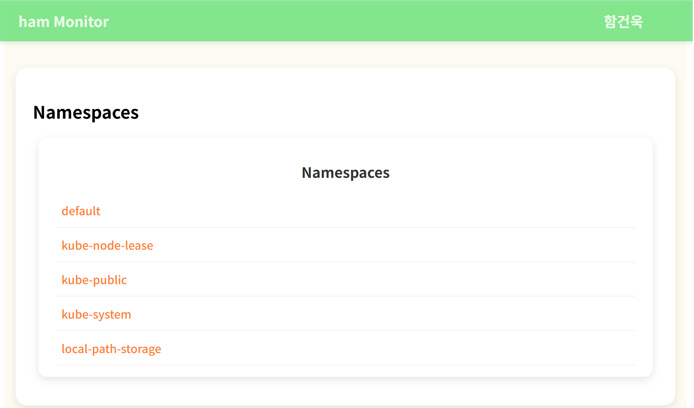
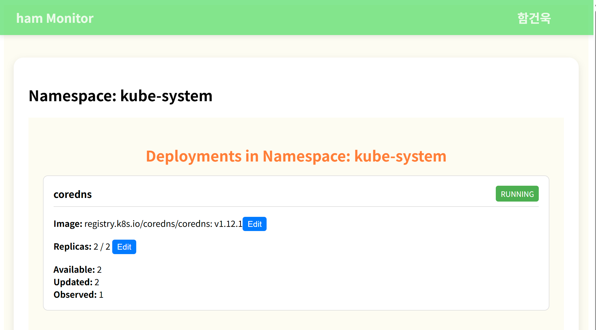
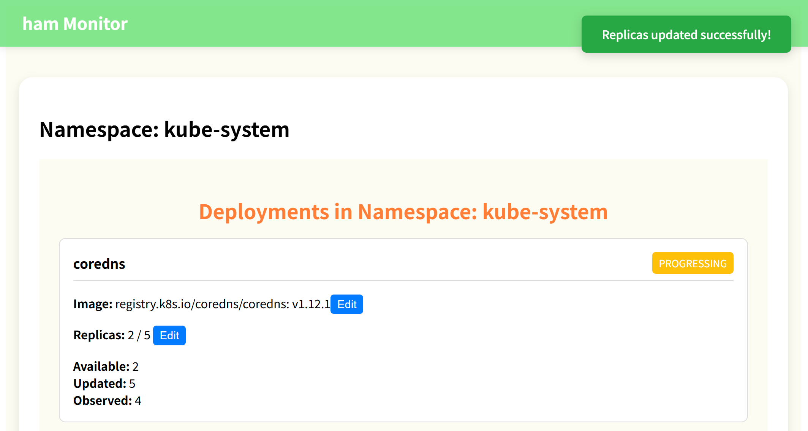
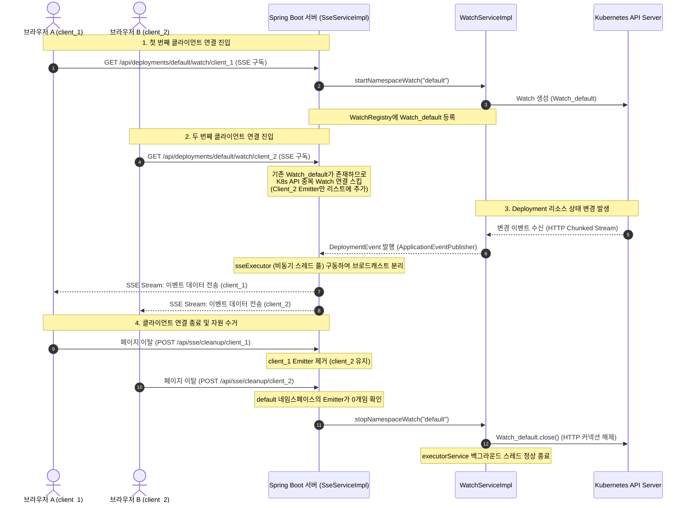

# ham 모니터 (ham Monitor) - Kubernetes 실시간 배포 모니터링 시스템

**작성자**: 함건욱 (Internship Candidate)

---

## 📌 프로젝트 소개

**ham 모니터(`ham Monitor`)** 는 Kubernetes 클러스터 내의 Deployment 리소스를 실시간으로 감시하고 관리할 수 있는 고품질 웹 기반 SRE(Site Reliability Engineering) 대시보드입니다.  
본 프로젝트는 **K8s API 서버의 오버헤드를 원천적으로 방지**하면서, **5초 이내의 실시간 상태 데이터 동기화(Real-time State Synchronization)**를 안정적으로 수행할 수 있도록 설계되었습니다.

### 🌟 핵심 기능
* **Namespace 탐색 및 통합 관리**:
  * Kubernetes 클러스터 내 활성화된 모든 Namespace 리스트 동적 조회.
  * 특정 Namespace 선택 시 하위의 모든 Deployment 리소스를 카드 형태의 UI 컴포넌트로 시각화.


* **Deployment 실시간 모니터링 (준실시간 보장)**:
  * 복제본(Replica) 상태(`Ready` / `Desired`) 및 상태 변경을 5초 이내에 UI에 반영.
  * 컨테이너 이미지 태그 및 배포 상태(Running, Progressing, Failed, Unknown) 노출.
  * 배포 지연/실패(`ProgressDeadlineExceeded`) 발생 시, 백엔드로부터 감지된 에러의 상세 원인(`Reason`, `Message`)을 대시보드에 즉시 시각화하여 운영 편의성 제공.


* **Deployment 실시간 제어 및 정밀 업데이트**:
  * 대시보드 상에서 복제본 수(Replicas) 및 컨테이너 이미지 태그 즉각 변경 요청.
  * 프론트엔드 입력 폼 단계의 유효성 검증(음수 복제본 차단, 공백/빈 이미지 태그 입력 방어).
  * 업데이트 처리 시 동기식 브라우저 `alert()`를 걷어내고, 부드러운 페이드인/아웃 트랜지션 애니메이션을 제공하는 **커스텀 Toast UI** 알림 탑재.


---

## 🏗️ 전체 시스템 아키텍처 (Architecture)

본 프로젝트는 불필요한 K8s API 호출을 방지하고 커넥션을 안전하게 관리하기 위해 **"네임스페이스당 단 1개의 Watch ➔ N개의 클라이언트 브로드캐스트"** 및 **"Spring 비동기 이벤트 발행을 통한 스레드 풀 분리"** 구조를 채택하고 있습니다.

### 1. 이벤트 흐름 시퀀스 다이어그램



### 2. 설계 핵심 포인트
* **K8s API 서버 부하 방지**: 100명의 사용자가 동일한 네임스페이스를 보더라도 K8s API 서버와 맺는 HTTP 커넥션은 항상 **네임스페이스당 1개**로 제한됩니다.
* **비동기 격리**: 이벤트 데이터를 클라이언트(SSE)로 전송할 때 발생하는 지연이 K8s Watcher 스레드에 영향을 주지 않도록 **이벤트 루프 스레드 풀을 비동기 분리**하였습니다.
* **자원 누수 원천 차단**: 클라이언트의 비정상 종료, 이탈 발생 시 `cleanup` 컨트롤러와 Emitter Callback을 통해 백엔드의 백그라운드 스레드 및 HTTP 커넥션 자원을 즉각 반환합니다.

---

## 🔌 API 규격서 (API Specification)

### 1. HTTP API 목록

| 기능 분류 | HTTP 메서드 | 엔드포인트 URI | Request Payload / Parameter | Response Format | 설명 |
| :--- | :--- | :--- | :--- | :--- | :--- |
| **Namespace** | `GET` | `/api/namespaces` | 없음 | `List<String>` | 클러스터 내의 모든 네임스페이스 리스트 조회 |
| **Deployment** | `GET` | `/api/deployments/{namespace}` | `{namespace}` (Path Variable) | `List<Map<String, Object>>` | 해당 네임스페이스의 초기 Deployment 리스트 조회 |
| **Deployment** | `POST` | `/api/deployments/{namespace}/{name}/replicas/{replicas}` | `{namespace}`, `{name}`, `{replicas}` (Path Variable) | `String` (`"Updated successfully"`) | Deployment의 복제본(Replicas) 개수 수정 |
| **Deployment** | `POST` | `/api/deployments/{namespace}/{name}/image/{image}` | `{namespace}`, `{name}`, `{image}` (Path Variable, 예: `nginx:1.25`) | `String` (`"Updated successfully"`) | Deployment의 컨테이너 이미지 태그 수정 |
| **SSE 스트림** | `GET` | `/api/deployments/{namespace}/watch/{clientId}` | `{namespace}`, `{clientId}` (Path Variable) | `text/event-stream` (SSE Stream) | 해당 네임스페이스의 실시간 리소스 변경 감지 스트림 구독 |
| **SSE 스트림** | `POST` | `/api/sse/cleanup/{clientId}` | `{clientId}` (Path Variable) | `String` (`"SSE connections cleaned: X"`) | 클라이언트 이탈 시 해당 클라이언트의 SSE 연결 및 맵 리소스 강제 수거 |

---

## 🛠️ 개발 환경 및 사양 (Requirements)

### 1. 기술 스택 버전 정보
* **Backend**: Java 23 (OpenJDK), Spring Boot 3.4.1, Kubernetes Java Client 20.0.0, Gradle
* **Frontend**: Node.js 18+ (React 18.3.1, Vite 6.0.3, Axios 1.7.9, React Router DOM 7.1.1)
* **Kubernetes**: 로컬 가상 클러스터 도구([KIND](https://kind.sigs.k8s.io/) 혹은 [Minikube](https://minikube.sigs.k8s.io/)) 및 `kubectl`

---

## 🚀 기동 및 테스트 방법

### 1. Kubernetes 로컬 테스트 환경 구성
클러스터 기동 후, 대시보드 동작을 확인하기 위한 샘플 Deployment를 다중 네임스페이스에 걸쳐 배포합니다.

#### 가. KIND 클러스터 기동
```bash
# KIND 클러스터 생성
kind create cluster --name ham-monitor
```

#### 나. 샘플 YAML 파일 생성 및 배포
테스트를 위해 로컬 디렉토리에 `sample-resources.yaml` 파일을 다음과 같이 작성합니다:

```yaml
apiVersion: v1
kind: Namespace
metadata:
  name: test-app
---
apiVersion: apps/v1
kind: Deployment
metadata:
  name: nginx-sample
  namespace: test-app
spec:
  replicas: 3
  selector:
    matchLabels:
      app: nginx
  template:
    metadata:
      labels:
        app: nginx
    spec:
      containers:
      - name: nginx
        image: nginx:1.23.4
        ports:
        - containerPort: 80
```

작성된 명세를 클러스터에 배포합니다:
```bash
kubectl apply -f sample-resources.yaml
```

### 2. Back-end 애플리케이션 실행
백엔드 루트 디렉토리로 이동하여 단위 테스트를 먼저 수행한 후, 서버를 기동합니다.

```bash
cd backend

# 1. 26개 단위 테스트 케이스 및 Coverage 리포트 검증
./gradlew test

# 2. Spring Boot 서버 구동 (기본 포트: 8080)
./gradlew bootRun
```

### 3. Front-end 클라이언트 실행
프론트엔드 루트 디렉토리로 이동하여 의존성 모듈 설치 후 개발 서버를 구동합니다.

```bash
cd frontend

# 1. npm 패키지 의존성 다운로드
npm install

# 2. Vite HMR 로컬 개발 서버 실행 (기본 포트: 3000)
npm run dev
```

### 4. 대시보드 테스트 시나리오
1. 브라우저로 [http://localhost:3000](http://localhost:3000)에 접속합니다.
2. Namespace 목록 화면에서 `test-app`을 클릭하여 상세 대시보드로 진입합니다.
3. 카드 컴포넌트 상의 Replicas를 `3`에서 `5`로 수정한 후 "수정" 버튼을 클릭합니다.
   * **검증**: 부드러운 Toast 알림 팝업과 함께, 1~2초 내로 `Ready / Desired` 상태가 `3 / 5` ➔ `5 / 5`로 실시간 변경되는지 화면을 확인합니다.
4. 이미지 태그를 존재하지 않는 태그(예: `nginx:9.9.9-invalid`)로 수정하여 배포를 전송합니다.
   * **검증**: K8s 배포 실패 스펙이 적용되어 카드 하단에 붉은 알림으로 `ProgressDeadlineExceeded` 및 그 원인 메시지가 실시간으로 시각화되는지 검증합니다.

---

## 💎 코드 리팩토링 및 개선 내역 요약 (Refactoring Summary)

본 프로젝트는 프로토타입의 자원 누수 및 구조적 취약점을 보완하기 위해 다각도의 리팩토링을 수행했습니다. 상세 기술 원리 및 소스 코드 연동 설명은 각 파트별 [README] 링크를 참조하십시오.

| 리팩토링 구분 | 개선 요약 항목 | 상세 기술적 성과 및 의도 | 상세 가이드 링크 |
| :--- | :--- | :--- | :--- |
| **Back-end** | **완벽한 백그라운드 리소스 해제** | `@PreDestroy` 콜백 장착으로 WAS 셧다운 시 백그라운드 스레드 풀(`ExecutorService`) 자동 회수 보장 | [backend/README.md](backend/README.md#1-완벽한-백그라운드-리소스-해제-predestroy-lifecycle-hook) |
| **Back-end** | **글로벌 ObjectMapper 빈 바인딩** | 정적 생성을 지양하고 Spring 글로벌 싱글톤 `ObjectMapper` 주입을 통해 스레드 경합 방지 및 성능 튜닝 | [backend/README.md](backend/README.md#2-글로벌-objectmapper-싱글톤-빈-바인딩) |
| **Back-end** | **CopyOnWriteArrayList 적용** | 락-프리 브로드캐스트 구현 및 `removeEmitterFromNamespace` 수거 단일 창구화로 스레드 경합 예외 차단 | [backend/README.md](backend/README.md#3-copyonwritearraylist와-emitter-해제-단일-통로화) |
| **Front-end** | **HTTP 모듈 공통화 (`apiClient.js`)**| API 호스트 하드코딩 중복 제거 및 `VITE_API_URL` 환경 변수 동적 스위칭 적용 | [frontend/README.md](frontend/README.md#1-프론트엔드-http-모듈-공통화-apiclientjs) |
| **Front-end** | **입력 유효성 검증 필터링** | 음수 복제본 제한 및 공백 이미지 태그 요청 전송 차단 폼 밸리데이터 구현 | [frontend/README.md](frontend/README.md#2-입력-데이터-폼-유효성-검증validator-장착) |
| **Front-end** | **Premium Custom Toast UI** | 브라우저 차단식 `alert()`를 제거하고 CSS 페이드 트랜지션을 가미한 세련된 논블로킹 토스트 알림 도입 | [frontend/README.md](frontend/README.md#3-premium-ux를-충족하는-커스텀-toast-ui-알림-시스템-alert-제거) |